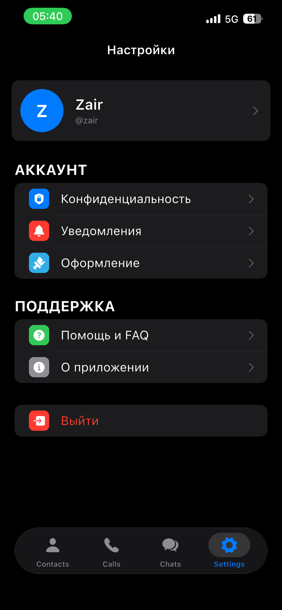
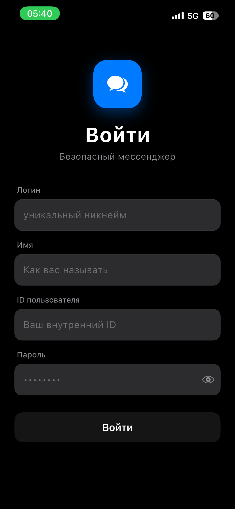
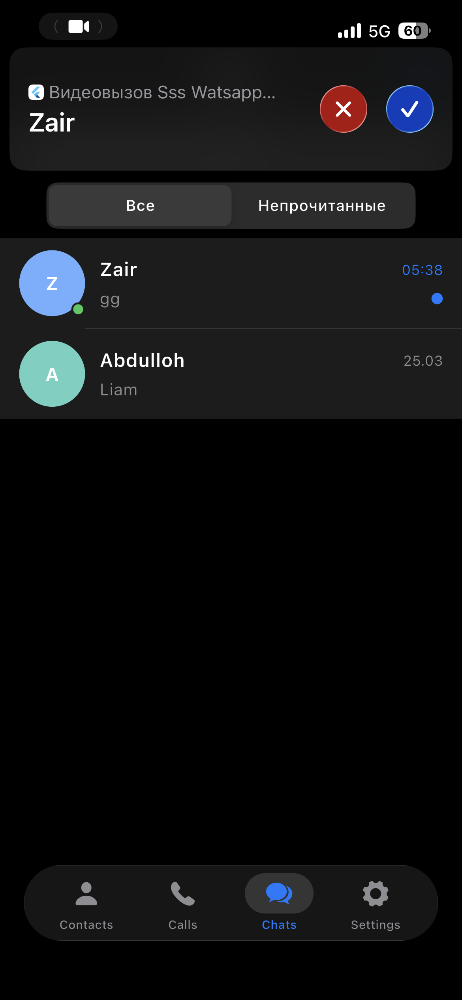
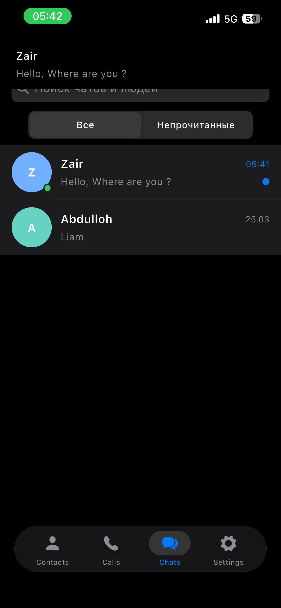
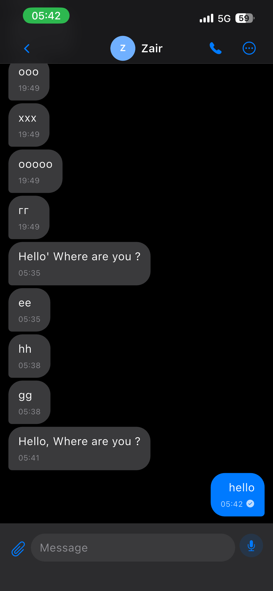
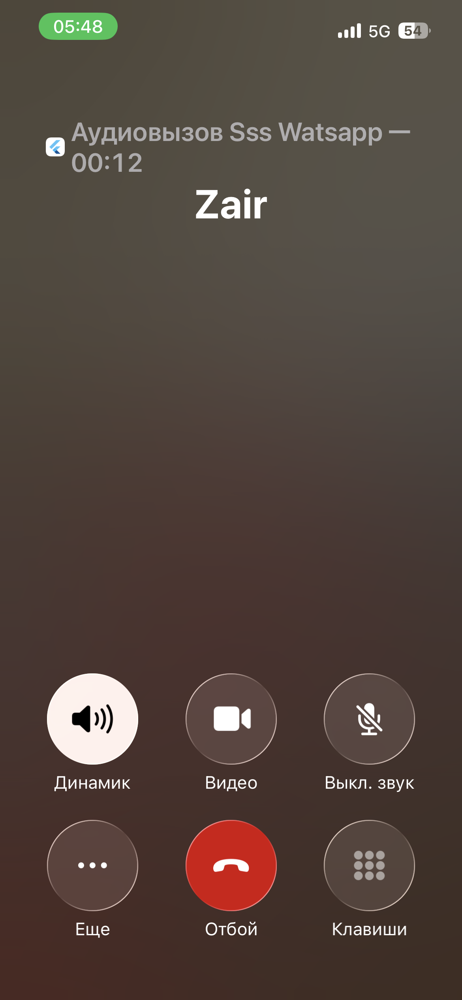
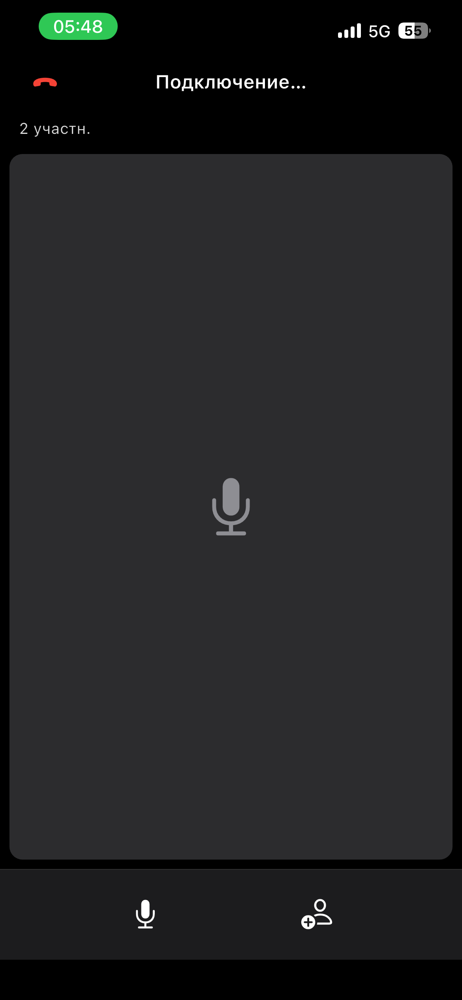

# Secure Chat (SSS WhatsApp)

A WhatsApp-style mobile chat client built with **Flutter**. It combines a REST API for chats with **Firebase** (authentication helpers, Firestore user data, Cloud Storage, FCM) and **Agora** for video calls, plus native-style UI (Cupertino-first) and BLoC state management.

The app demonstrates end-to-end product thinking: authentication, chat list, messaging UX, media and voice messages, push notifications, and video calling.

## Screenshots

Screenshots live in [`docs/screenshots/`](docs/screenshots/).

| | |
| --- | --- |
|  |  |
|  |  |
|  |  |
|  |  |

## Why this project

- Feature-based layout (`auth`, `chat`, `call`, `home`, `settings`, `core`, `service`)
- API-first chat backend with optional **mock auth** for demos
- **Firebase** integration for messaging, storage, and session hydration
- **Video calls** via Agora and ConnectyCube Call Kit hooks
- Stateful UI with **BLoC** and async/error handling
- Mobile capabilities: camera, gallery, file picker, microphone, local notifications

## Key features

- **Authentication**: login with validation (username, full name, user ID, password); optional mock mode
- **Session**: tokens and user profile fields persisted locally (`SharedPreferences` + Firebase session sync)
- **Chat list**: search, unread filter, pin/unpin, swipe actions
- **Messaging**: text, image, file, and voice messages; edit/delete messages; conversation actions
- **Calls**: video calling (Agora) with incoming-call handling integration
- **Notifications**: FCM and local notifications for data messages and call flows
- **Settings** and root navigation with themed light/dark UI
- **Permissions**: guided flow for camera, microphone, and media library

## Tech stack

| Area | Packages / services |
| --- | --- |
| UI & state | Flutter, `flutter_bloc`, `equatable`, `google_fonts`, `cupertino_icons` |
| Networking | `dio`, custom interceptors |
| Local storage | `shared_preferences` |
| Firebase | `firebase_core`, `firebase_auth`, `cloud_firestore`, `firebase_storage`, `firebase_messaging`, `firebase_app_check` |
| Calls | `agora_rtc_engine`, `connectycube_flutter_call_kit` |
| Media | `image_picker`, `file_picker`, `record`, `audioplayers` |
| Notifications | `flutter_local_notifications` |
| Other | `permission_handler`, `uuid` |

## Architecture

Layered, feature-first structure:

- **`presentation`**: pages, widgets, BLoC
- **`domain`**: entities, repository contracts
- **`data`**: remote data sources, repository implementations
- **`service`**: API client, DB/session helpers, Firebase bootstrap, notifications
- **`core`**: theme, constants, shared widgets

### Project structure (overview)

```text
lib/
  core/
  features/
    auth/
    chat/
    call/
    home/
    settings/
  service/
  app.dart
  main.dart
  firebase_options.dart
```

## Getting started

### Prerequisites

- [Flutter SDK](https://docs.flutter.dev/get-started/install) (Dart ^3.10)
- Xcode (iOS) and/or Android Studio (Android)
- Firebase project with iOS/Android apps configured (see below)
- Agora / ConnectyCube credentials if you use video calling

### 1) Install dependencies

```bash
flutter pub get
```

### 2) Firebase

The repo expects Firebase config files in the usual locations:

- **Android**: `android/app/google-services.json`
- **iOS**: `ios/Runner/GoogleService-Info.plist`

Regenerate `lib/firebase_options.dart` with FlutterFire if you use a new Firebase project:

```bash
dart run flutterfire configure
```

Firestore rules, indexes, and Storage rules are under `firestore.rules`, `firestore.indexes.json`, and `storage.rules` at the repo root (adjust for your environment).

### 3) API (chat backend)

Update [`lib/core/constants/api_constants.dart`](lib/core/constants/api_constants.dart):

- `baseUrl` — REST API host
- `apiToken` — if your backend requires a static token

### 4) Run the app

```bash
flutter run
```

### Demo mode (no real auth backend)

Uses a mock auth repository—useful for UI demos when the API is down:

```bash
flutter run --dart-define=USE_MOCK_AUTH=true
```

## Backend endpoints (chat API)

- `POST /api/auth/login`
- `GET /api/chats`
- `POST /api/chats/start`
- `GET /api/chats/{chatId}/messages`
- `POST /api/chats/{chatId}/send/text`
- `POST /api/chats/{chatId}/send/media`
- `POST /api/files/upload-{kind}`
- `PATCH /api/chats/{chatId}/messages/{messageRef}`
- `DELETE /api/chats/{chatId}/messages/{messageRef}`
- `DELETE /api/chats/{chatId}`

## Tests

```bash
flutter test
```

## License / portfolio

Private / portfolio use unless you add an explicit license.

If you are reviewing this as part of a portfolio, I can provide a short architecture walkthrough and a live demo flow.
